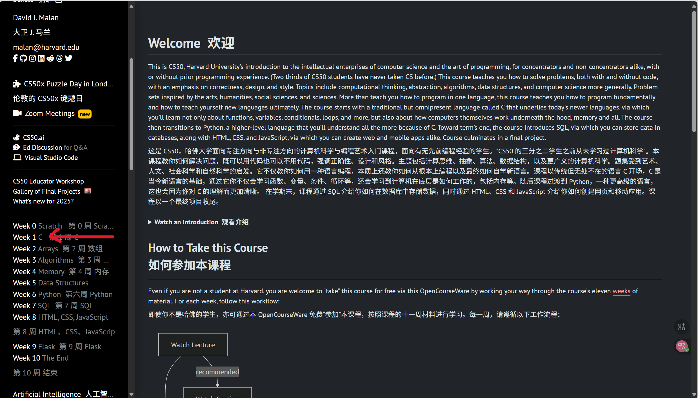
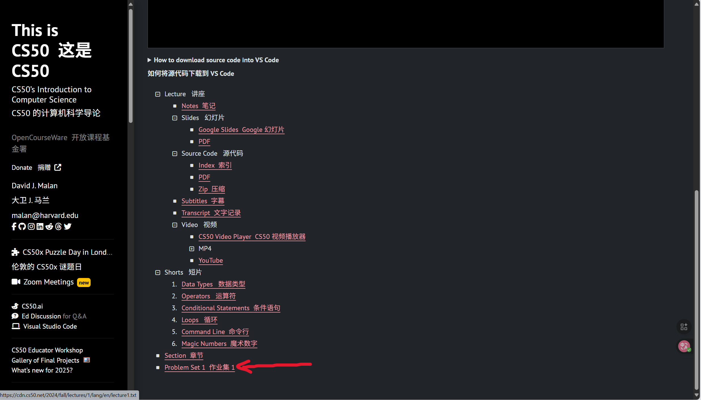
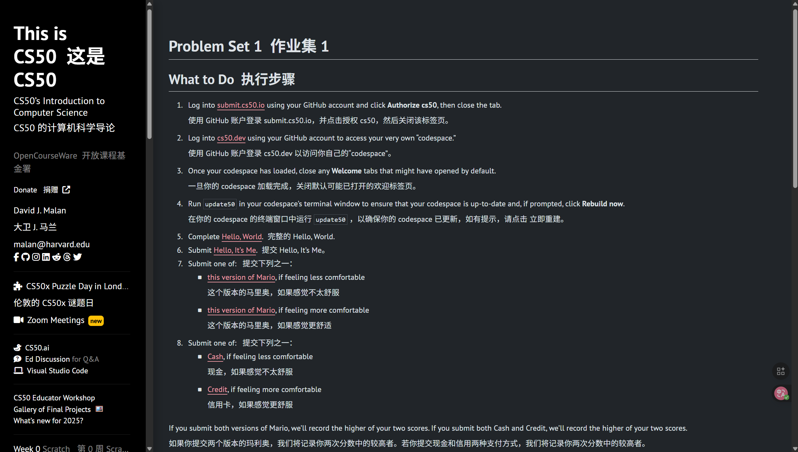
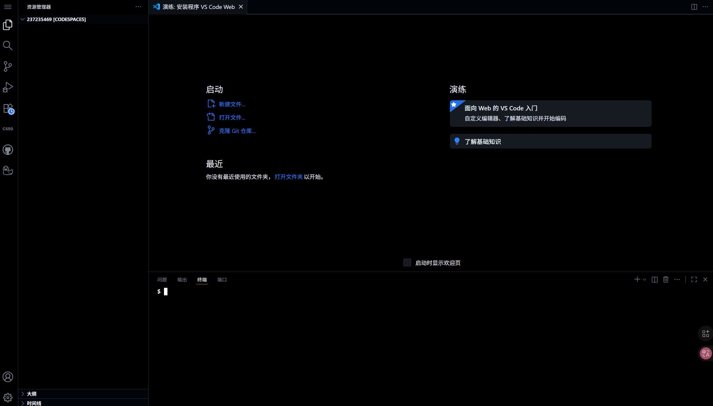

# CS50入门教程

## 预先准备

首先，在开始之前，面对全英文的cs50网站，准备一个浏览器的翻译插件是必要的。这里推荐根据[AI翻译插件配置教程 | scandi-blog](https://scandidreams.top/2025/08/31/AI%E7%BF%BB%E8%AF%91%E6%8F%92%E4%BB%B6%E9%85%8D%E7%BD%AE%E6%95%99%E7%A8%8B/)来设置。若不想太麻烦，可以先选择有道灵动翻译插件先体验，在之后如果感觉翻译的晦涩难懂，跟原文有偏差，可以再使用AI翻译插件。

其次，由于众所周知的原因，梯子的准备会让学习的过程更加顺畅。

另外，也需要注册一个github账号，并提前在电脑上安装VSCode。

## 关于CS50的环境配置

CS50的学习主要分为看课程和提交作业两大项。关于课程的观看，可以直接在B站搜索CS50的相关课程资源来学习。观看一节课程，提交一节作业。

提交作业即需要配置相关的环境了。再点击进入csdiy中的2025年课程后，下滑左侧栏，找到Week 1 C，点击进入。

点开后，下滑右侧栏至底部，找到Problem Set 1（作业集1）。

点击进入后，便可看到配置环境的一些步骤。

首先进行步骤一，点开链接后，点击Authorize cs50（授权cs50）后，可退回进行步骤2。

进入[CS50.dev ](https://cs50.dev)后，使用github账号log in后，便可看到网页版的VSCode。

但是在这个网页上做CS50的作业是非常卡顿的。若将其连接到本地VSCode，卡顿的情况将会大大改善。

#### 将 CS50 网页端的 VSCode 环境连接到本地 VSCode

打开电脑中下载的VSCode软件，安装GitHub Codespaces扩展，成功后会发现左侧栏出现新标识（远程资源管理器），点击进入，并登录github账号，便可将网页端的VSCode连接到本地，此后可以愉快的在本地写CS50的作业啦！前提是每次连接前需要进入[CS50.dev ](https://cs50.dev)打开网页端。

祝大家学习愉快！